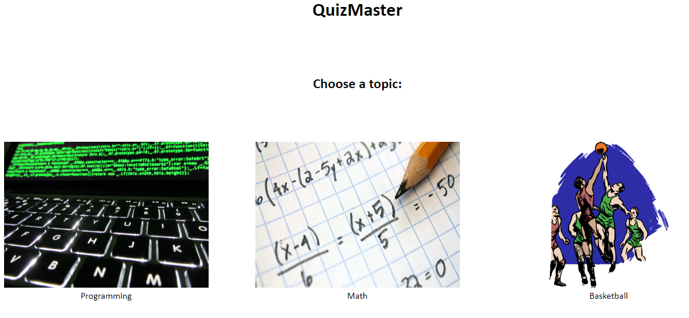
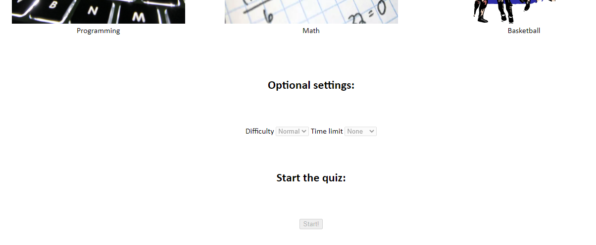
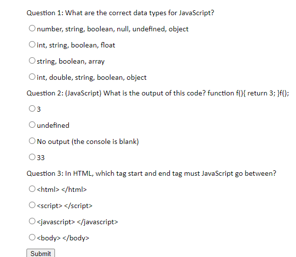

#Video Link
[Part 5 Video link](https://www.loom.com/share/439d3524ce604467a33c83ff3da4cb5e)

<pre><pre><pre><pre>

#Interace Images

This is the starting menu of the website. The user will click on one of the pictures which represents each topic.

<pre><pre><pre><pre>

This is where the user will adjust the optional settings, if desired. Once the user has been chosen a topic by clicking one of the pictures above, they will be allowed to change the settings or they can start the quiz.

<pre><pre><pre><pre>

This is where the user will take the quiz. The JavaScript will compute if each radio button clicked corresponds to the correct answer. Once the user clicks the 'submit' button, the scoce will be calculated.

This is the final 'screen' of the interface. The user will be given their score out of 3 to let them know how they did.  